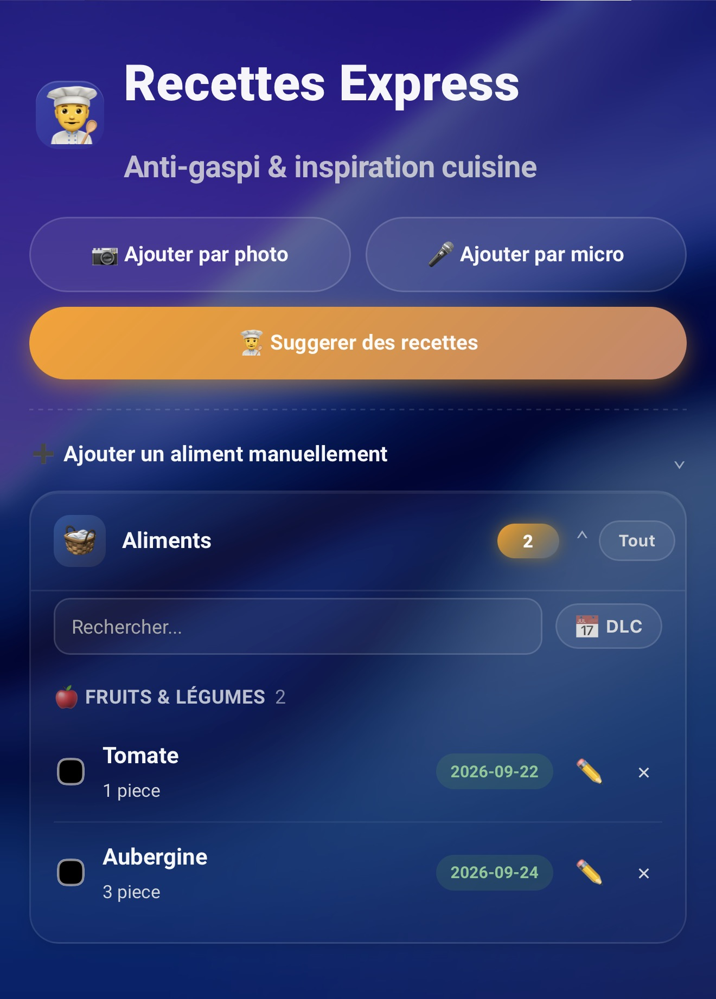
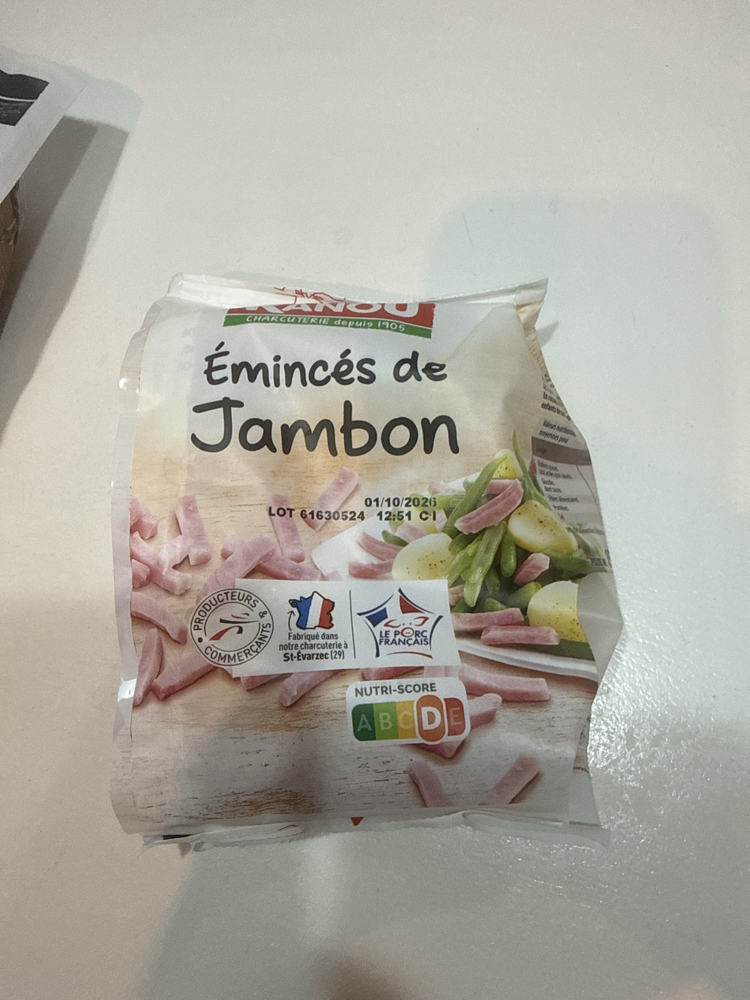
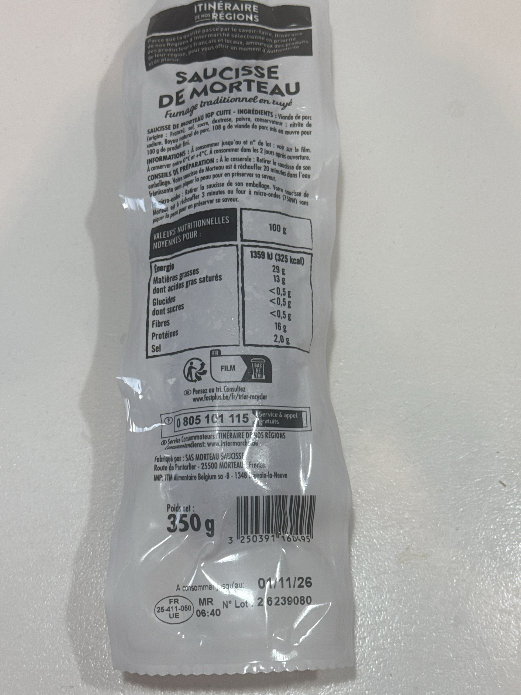

# Recettes Express

[](https://github.com/cyclope205/recettes-express/releases)
[](https://github.com/cyclope205/recettes-express/actions/workflows/validate.yml)
[](https://github.com/cyclope205/recettes-express/actions/workflows/tests.yml)
[](LICENSE)
[](https://github.com/hacs/integration)

### ☕ Merci aux donateurs

<!--START_SECTION:buy-me-a-coffee-->
<!-- Les nouveaux dons seront ajoutés ici automatiquement -->
<!--END_SECTION:buy-me-a-coffee-->

[](https://changelog-traduction.vercel.app/api/donate?repo=recettes-express)
[](https://paypal.me/cyclope205)


Integration Home Assistant pour gerer le stock d'aliments (frigo, garde-manger) et obtenir des suggestions de recettes anti-gaspi generees par IA (Gemini), avec deduction automatique du stock.


## Captures d’ecran

---


Vue d'ensemble : bloc d'actions (photo, ajout manuel) et recettes suggerees juste sous l'entete, aliments a suivre en dessous :



---
Suggestions de recettes generees par IA, affichees directement sous le bloc d'actions :


## Fonctionnalites

- Ajout d'aliments par photo, par micro (reconnaissance vocale en francais) ou manuellement, avec date de peremption obligatoire
- Gestion du stock : modification, suppression, recherche, tri (nom ou date de peremption)
- Suggestions de recettes anti-gaspi a partir du stock (ou d'une selection d'aliments), avec temps de preparation estime, et options facultatives via le bouton ⚙️ (nombre de personnes, vegetarien uniquement, temps de preparation maximum)
- Validation d'une recette : deduction automatique des ingredients utilises, la recette reste affichee jusqu'a confirmation de fin
- Categorisation automatique des aliments par mots-cles (fruits & legumes, viandes & poissons, produits laitiers, surgeles, pain & boulangerie, condiments & epices, boissons, epicerie, autres)
- Section "Aliments selectionnes" epinglee en haut de la liste, qui apparait des qu'un aliment est coche
- Carte Lovelace personnalisee incluse (stock, aliments bientot perimes, recettes suggerees), avec le bloc d'actions et les recettes juste sous l'entete pour un acces rapide
- Capteurs : nombre d'aliments en stock, aliments bientot perimes

## Bien photographier un aliment

Pour que la reconnaissance par IA renseigne seule le nom de l'aliment et sa date de peremption (DLC), la photo doit montrer **a la fois** :

- le nom / descriptif du produit (etiquette de l'emballage)
- la date de peremption ou "a consommer jusqu'au" (DLC), imprimee ou estampillee sur l'emballage

Quelques conseils pour une detection fiable :

- a plat, cadrez l'emballage en entier, sans reflet ni ombre sur le texte
- rapprochez l'appareil ou zoomez pour que la date de peremption soit nette et lisible
- si le nom du produit et la DLC ne sont pas du meme cote de l'emballage, prenez une photo qui montre les deux, ou repliez l'emballage pour les faire apparaitre ensemble

Exemples de photos correctement cadrees (nom du produit et DLC lisibles) :




Sans ces informations visibles sur la photo, l'IA peut se tromper sur le nom de l'aliment ou ne pas detecter de date, ce qui oblige a completer les champs manquants a la main.

Si la date de peremption n'est pas lisible sur la photo, l'IA peut aussi l'estimer a partir du type de produit plutot que de la lire telle quelle. Dans ce cas, l'aliment ajoute au stock precise si la date vient de l'emballage ("imprimee") ou d'une estimation de l'IA ("estimee"), pour savoir quand la verifier vous-meme.

## Personnaliser les suggestions de recettes

A cote du bouton "👨‍🍳 Suggerer des recettes", un bouton ⚙️ ouvre un petit panneau d'options facultatives, prises en compte par l'IA au moment de generer les recettes :

- **👥 Personnes** : adapte les quantites des recettes pour ce nombre de convives.
- **⏱️ Temps max (min)** : ecarte les recettes dont le temps de preparation total depasserait cette limite.
- **🥦 Vegetarien uniquement** : ne propose que des recettes sans viande ni poisson.

Ces champs sont optionnels : laisses vides ou decoches, le comportement est identique a avant (aucune contrainte supplementaire). Comme pour le reste des suggestions, il s'agit de consignes donnees a l'IA et non de garanties absolues — verifiez toujours la recette proposee. Un garde-fou verifie chaque recette suggeree avant affichage : toute recette qui mentionnerait un ingredient absent du stock (hors basiques courants comme sel, huile ou eau) est automatiquement ecartee.


## Ajouter des aliments par micro

En plus de la photo, un bouton "🎤 Ajouter par micro" permet d'enregistrer un court message vocal (en francais) pour ajouter des aliments sans les taper. Enoncez simplement ce que vous rangez, par exemple : *"deux yaourts nature, ils perime dans une semaine"* ou *"une boite de conserve de haricots verts"*.

Comme pour la photo, l'IA (Gemini) analyse l'enregistrement et propose les aliments detectes pour confirmation avant tout ajout au stock. Si vous ne precisez pas de quantite, d'unite ou de date de peremption, des valeurs par defaut raisonnables sont proposees et restent modifiables avant validation.

> ⚠️ **Le micro necessite un acces a Home Assistant en HTTPS** (certificat local, reverse proxy, Nabu Casa, certificats Tailscale...). C'est une restriction des navigateurs eux-memes (l'API `getUserMedia` est bloquee hors HTTPS/localhost) : c'est exactement la meme limitation que rencontre l'Assist officiel de Home Assistant en HTTP simple. Sur un acces en `http://` (IP locale, Tailscale sans certificat...), le bouton affichera un message expliquant qu'il faut passer en HTTPS. L'ajout par photo n'est pas concerne, il fonctionne quel que soit l'acces.

## Installation

### Via HACS (recommande)

1. HACS > menu (...) > Depots personnalises
2. Ajouter `cyclope205/recettes-express` en categorie Integration

[](https://my.home-assistant.io/redirect/hacs_repository/?owner=cyclope205&repository=recettes-express&category=integration)

3. Installer "Recettes Express" depuis HACS
4. Redemarrer Home Assistant

### Manuelle

Copier le dossier `custom_components/recettes_express` dans le dossier `custom_components` de votre configuration Home Assistant, puis redemarrer.

## Configuration

L'integration se configure via l'interface (Parametres > Appareils et services > Ajouter une integration > Recettes Express). Elle necessite une cle API Gemini pour la reconnaissance photo et les suggestions de recettes.

La carte Lovelace est enregistree automatiquement. Exemple de configuration :

```yaml
type: custom:recettes-express-card
entity_stock: sensor.aliments
entity_expiring: sensor.bientot_perime
```

## Services

- `recettes_express.add_item` : ajouter un aliment au stock
- `recettes_express.update_item` : modifier un aliment existant
- `recettes_express.remove_item` : retirer un aliment du stock
- `recettes_express.add_item_from_photo` : detecter des aliments a partir d'une photo
- `recettes_express.suggest_recipes` : demander des suggestions de recettes (options facultatives : `servings`, `vegetarian`, `max_prep_minutes`)
- `recettes_express.accept_recipe` : valider une recette et deduire les ingredients du stock

\n\n\n\n## Licence

MIT — voir [LICENSE](LICENSE).

<div align="center">

-------------------------------------------------------------------------------------------------------------------------------------------------------------------
### ☕ Cette integration te plait ?

Si elle te fait gagner du temps, un petit don est toujours apprecie : ca m'aide a maintenir le projet et a ajouter de nouvelles fonctionnalites.

<a href="https://changelog-traduction.vercel.app/api/donate?repo=recettes-express"></a>
<a href="https://paypal.me/cyclope205"></a>

</div>
